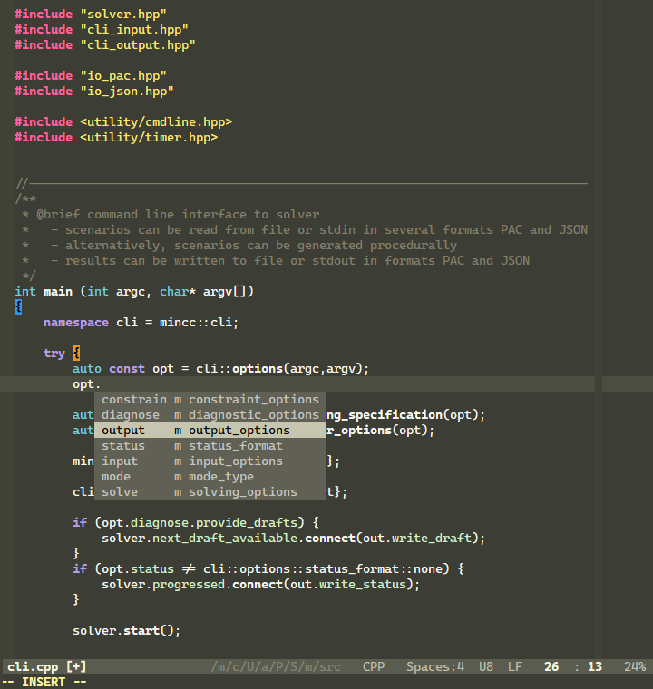
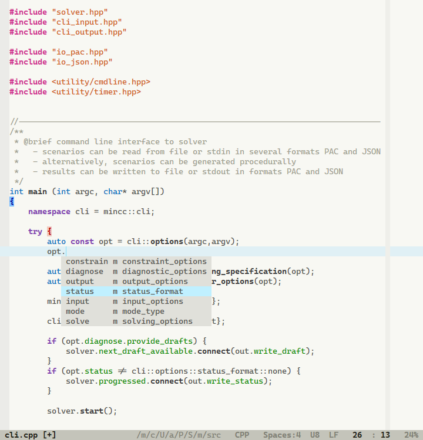
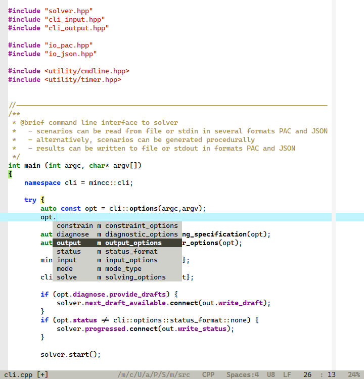

# am-colors

## amdark

## amlight

## ampresent
A light, high-contrast colorscheme optimized for presentations.

## Features

Although all schemes come with support for 256-color terminals they are best viewed with 24-Bit
color support (`set termguicolors`).

### Highlighting for Plugins
 - [ALE (Asynchronous Lint Engine)](https://github.com/w0rp/ale)
 - [bufexplorer](https://github.com/jlanzarotta/bufexplorer)
 - [Clap](https://github.com/liuchengxu/vim-clap)
 - [CleverF](https://github.com/rhysd/clever-f.vim)
 - CtrlP
 - [GitGutter](https://github.com/airblade/vim-gitgutter)
 - [HighlightedYank](https://github.com/machakann/vim-highlightedyank)
 - [braceless](https://github.com/tweekmonster/braceless.vim)
 - easytags
 - find & replace
 - indent guides
 - indent line
 - netrw
 - multi-cursor
 - [NERDTree](https://github.com/scrooloose/nerdtree)
 - [Poppy](https://github.com/bounceme/poppy.vim)
 - signify
 - [signature](https://github.com/kshenoy/vim-signature)
 - [startify ](https://github.com/mhinz/vim-startify)
 - [tagbar](https://github.com/preservim/tagbar)
 - [visual-multi](https://github.com/mg979/vim-visual-multi)

### Support for Newer Highlight Groups
 - [CurSearch](https://vimhelp.org/syntax.txt.html#hl-CurSearch)
 - [CursorLineSign](https://vimhelp.org/syntax.txt.html#hl-CursorLineSign)
 - [CursorLineFold](https://vimhelp.org/syntax.txt.html#hl-CursorLineFold)
 - [LineNrAbove](https://vimhelp.org/syntax.txt.html#hl-LineNrAbove)
 - [LineNrBelow](https://vimhelp.org/syntax.txt.html#hl-LineNrBelow)

### Special File Type Support
 - xml
 - html
 - json
 - Mathematica (mma)

License: GPL3
