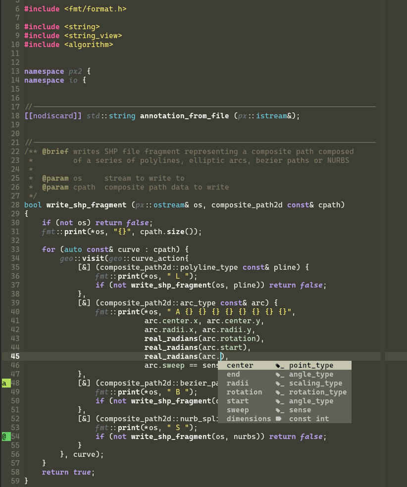
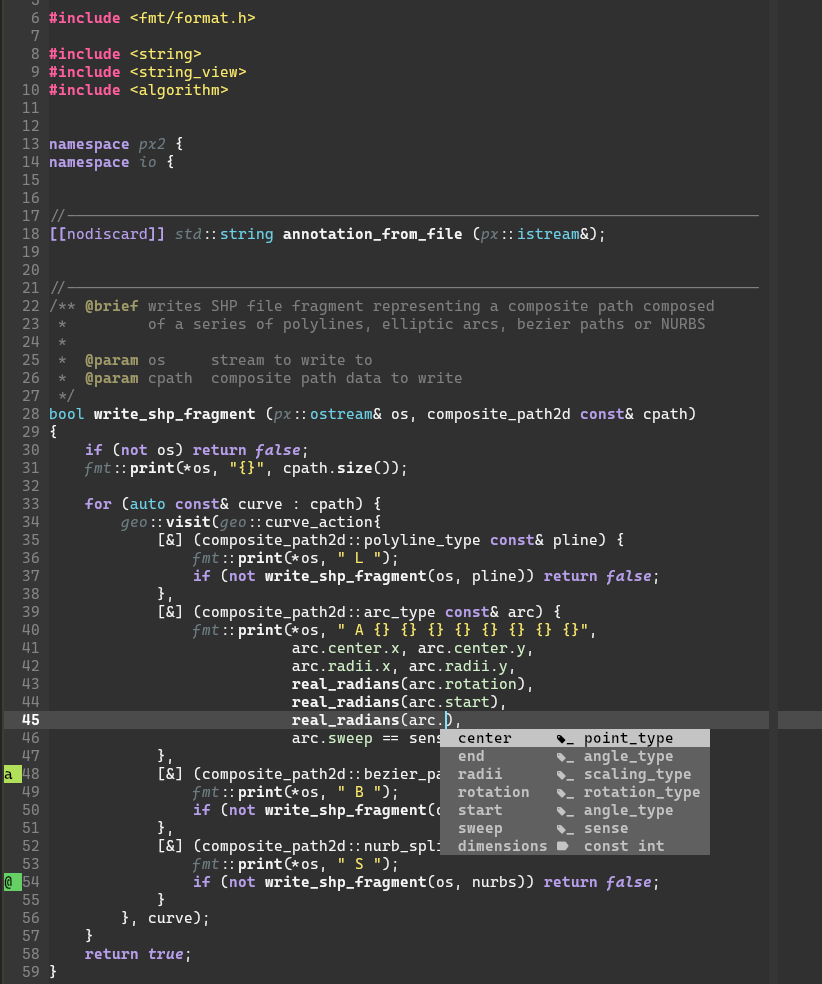
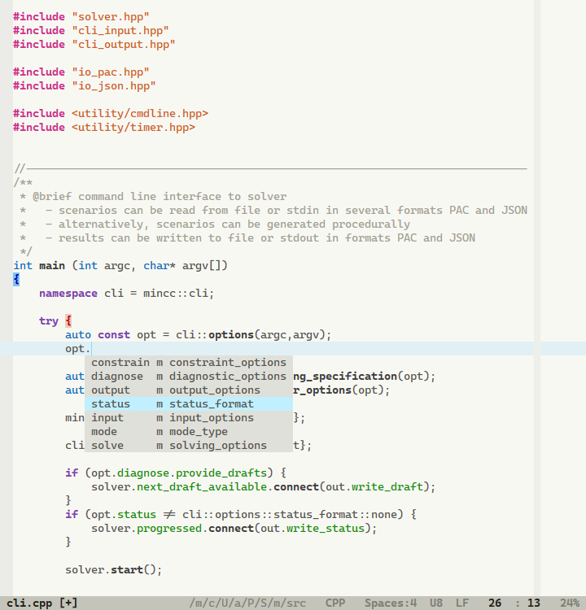
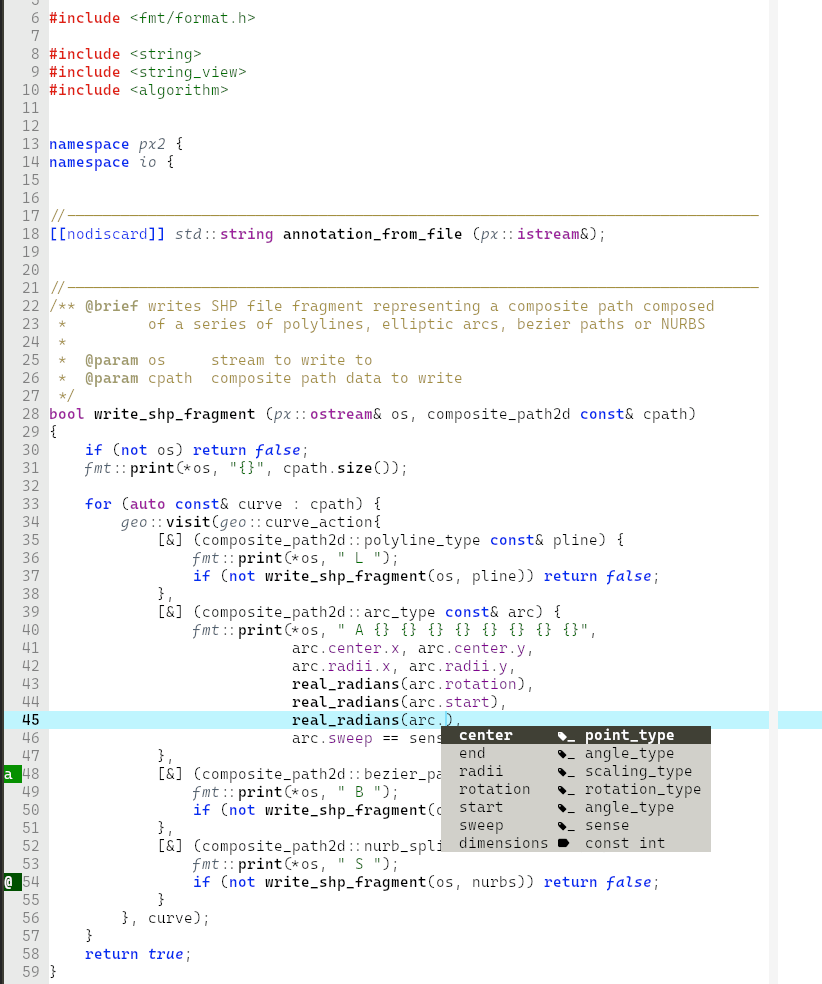

# AM Color Schemes

My personal VIM color schemes.

## amdark    
My default dark color scheme.

## amgray
A "cooler" dark scheme with less of a greenish/brownish tint.

## amlight    
A light color theme.

## ampresent
A light, high contrast theme optimized for presentations.

## Plugin Support

#### In active use
 - [vim-visual-multi](https://github.com/mg979/vim-visual-multi) - THE BEST multi cursor implementation
 - [vim-clap](https://github.com/liuchengxu/vim-clap) - great fuzzy finder/selector
 - [Clever-f](https://github.com/rhysd/clever-f.vim) - replacement for `f`/`t` search
 - [poppy.vim](https://github.com/bounceme/poppy.vim) - awesome multi-level matching paren/brace/bracket highlighting
 - [vim-highlightedyank](https://github.com/machakann/vim-highlightedyank)
 - [yegappan/lsp](https://github.com/yegappan/lsp) - Vim9-script based LSP client (very nice!)
 - [Vista](https://github.com/liuchengxu/vista.vim) - modern tagbar (works great with LSP)
 - [vim-gitgutter](https://github.com/airblade/vim-gitgutter)
 - [signature](https://github.com/kshenoy/vim-signature)
 - [easytree.vim](https://github.com/troydm/easytree.vim)
 - [NeoDebug](https://github.com/cpiger/NeoDebug)

#### Should still work, but not recently tested
 - [ALE](https://github.com/dense-analysis/ale)
 - indent line 
 - indent guides
 - buf explorer
 - braceless 
 - tagbar
 - CtrlP
 - FNR
 - Startify

## Special File Type Support
 - xml
 - html
 - json
 - Mathematica (mma)

License: GPL3
